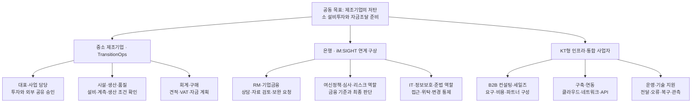

# TransitionOps
### 중소 제조기업의 저탄소 설비투자 업무지원

**공장 전체 전력자료만으로 설비 절감량을 확정하지 않고, 필요한 근거를 보완해 승인된 자료를 은행에 전달하는 데모입니다.**

한 가상 제조기업의 압축공기 계통 개선 투자에서 자료 준비 → 보완 요청 → 조건부 추정 → 공유 승인 → 견적 변경 → 재검토를 구현했습니다. 제조기업·은행·인프라 사업자가 각자의 책임을 유지하면서 하나의 전환 투자를 준비하는 구조입니다.

현재 버전은 **규칙 기반 업무 흐름 데모**입니다. 실시간 LLM·RAG, 실제 은행 연결, 별도 사용자 인증은 아직 없습니다.

[데모 열기 — 소유자 전용](https://transitionops.dtsy5891.chatgpt.site) · [시연 안내](docs/DEMO_GUIDE.md) · [구조와 데이터 교환](docs/ARCHITECTURE.md) · [공식 참고자료](docs/REFERENCES.md) · [구현 확인](app/docs/VALIDATION.md)

## 프로젝트 역할도

다음은 이 프로젝트에서 제안하는 역할 배분입니다. 실제 iM뱅크의 확정 조직도나 KT와의 계약 관계를 뜻하지 않습니다. 은행 측 기존 iM:SIGHT는 별도 프로젝트이며, 현재 데모에는 연결 상대를 설명하는 은행 RM 화면이 있습니다.



| 주체 | 맡는 일 | 이번 데모에서 보이는 것 |
|---|---|---|
| 제조기업 | 현장 근거, 기술 조건, 공유 범위 판단 | 합성 문서 검토, 계산 조건 확인, 견적 변경 영향, 공유 승인 |
| 은행 | 전달받은 자료로 상담·심사 준비 | 승인본 열람, 계측 근거 보완 요청, 버전별 검토 기록 |
| 인프라·통합 사업자 | 실행 환경과 연동의 구축·운영 | 전달 이력, 실패 재현, 승인본 재전달 |

운영 역할은 기업의 공유 승인이나 은행의 금융 판단을 대신하지 않습니다. 클라우드·네트워크·관제 구축 전체를 이 데모가 구현한 것은 아닙니다.

## 해결하려는 구체적 문제

가온정밀 데모제조(가상)는 압축공기 설비를 개선하려 합니다. 하지만 공장 전체 고지서만으로는 해당 계통의 기준 사용량을 알 수 없습니다. 시설 담당자의 계측 범위·운전 조건 확인이 필요하고, 나중에 드라이어가 추가된 견적을 받으면 투자비와 절감 추정을 다시 살펴봐야 합니다.

제조기업이 문서를 수정할 때마다 은행 자료를 즉시 덮어쓰면, 어느 자료를 승인·검토했는지 불분명해집니다. TransitionOps는 내부 자료와 외부에 승인해 보낸 자료를 별도 버전으로 다룹니다.

## 구현한 흐름

1. 절감량을 미산정 상태로 둔 상담 준비본을 공유합니다.
2. 은행 RM이 계측 범위·운전 근거 보완을 요청합니다.
3. 제조기업이 시설 회신을 받고, 경계·연간 환산·생산 조건을 확인합니다.
4. 조건부 추정과 선택한 근거를 승인해 새 공유본으로 전달합니다.
5. 은행이 받은 자료의 검토 기록을 남깁니다.
6. 제조기업이 변경 견적 v2를 받아 비용·계통·공기질 조건을 재확인합니다.
7. 재승인 전에는 은행의 이전 공유본이 유지됩니다. 새 승인본을 받으면 재검토가 필요해집니다.
8. 전달 실패를 재현하고, 같은 승인본을 중복 생성하지 않고 다시 전달할 수 있습니다.

자동 보완 요청의 현재 범위는 **계측·운전 근거**입니다. 자부담·담보·금융 조건 질의응답과 대출 승인 기능은 포함하지 않습니다.

## 합성 데이터와 계산

기업·견적·운전 수치는 직접 구성한 시연 자료입니다. 공개 기술자료는 검토 원리의 근거로만 사용했습니다.

| 항목 | 견적 v1 | 견적 v2 |
|---|---:|---:|
| 구성 | 압축기 교체·기존 드라이어 유지 | 압축기 교체·신규 드라이어 추가 |
| 공급가 | 4,800만원 | 5,500만원 |
| VAT 포함 지급액 | 5,280만원 | 6,050만원 |
| 예상 전력 절감 | 35,200kWh/년 | 39,200kWh/년 |
| 예상 전력비 절감 | 528만원/년 | 588만원/년 |
| 단순 회수기간 | 9.09년 | 9.35년 |

80시간의 합성 운전 표본을 연 4,000시간으로 환산하고, 가상 단가 150원/kWh를 적용했습니다. 회수기간은 공급가를 연 전력비 절감으로 나눈 값이며 금융·유지비를 제외합니다. CO₂ 감축량은 적용 배출계수와 조건이 확정되지 않아 미산정입니다.

v2는 절감량이 커져도 추가 투자비 때문에 단순 회수기간이 길어집니다. 따라서 “절감량 증가 = 더 좋은 투자”로 자동 결론 내리지 않습니다.

## 실행

Node.js 22.13 이상이 필요합니다. 별도 API 키는 필요하지 않습니다.

```bash
git clone https://github.com/LDY5388/TransitionOps.git
cd TransitionOps/app
npm ci
npm run dev
```

표시되는 로컬 주소에서 제조기업·은행 RM·운영 역할을 전환합니다. 상태는 브라우저 로컬 저장소에 보관되며, 화면 하단에서 시연을 초기화할 수 있습니다.

```bash
npm test
npx tsc --noEmit
npm run build
```

2026-09-06 기준 업무·계산 검사 10개, TypeScript, 빌드, 로컬 첫 화면 HTTP 200을 확인했습니다. 브라우저 클릭·반응형·시각 QA와 WebMCP 실행은 확인하지 않았습니다. 실제 제조 성과나 금융 승인을 실증한 결과가 아닙니다.

## 구현 범위와 다음 단계

| 현재 구현 | 후속 구현 |
|---|---|
| 합성 문서와 규칙 기반 검토 초안 | 실제 파일 업로드·문서 추출·출처 위치 연결 |
| 결정된 산식과 사람이 확인하는 조건 | 제조 문서 RAG·LLM 초안 생성, 근거 부족 시 보류 |
| 허용 항목으로 구성한 승인 공유 JSON | 서버 저장소·사용자 인증·기관별 권한·감사 기록 |
| 같은 브라우저의 제조·은행·운영 역할 | 독립 서비스 사이의 데이터 계약과 API 연동 |
| 견적 변경과 공유본 버전 관리 | 자금조달 경로별 체크리스트·집행·설치 후 보고 |

역할 탭은 업무 경계를 설명하는 미리보기입니다. 합성 원문도 클라이언트에 포함되므로, 실제 보안 격리나 원문 접근 차단을 구현한 것으로 해석하지 않습니다. 기존 SECOM과 iM:SIGHT 앱은 유지하며, 이 저장소는 제조기업 측 업무를 확장하는 별도 프로젝트입니다.

AI 도구를 활용해 구현한 개인 프로젝트입니다. 현장 도입·기관 협업·실제 절감 성과를 주장하지 않습니다. 프로젝트 자체 코드의 재배포 라이선스는 아직 지정하지 않았으며, 포함된 의존성과 제3자 자료의 권리는 각각의 조건을 따릅니다.
