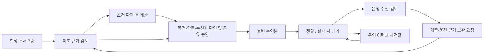

# 구조와 데이터 교환

## 책임을 나누는 이유

제조기업은 현장 문서의 정확성과 기술 조건을 확인하고 외부 공유를 승인합니다. 은행은 승인 자료를 이용해 금융 검토를 진행합니다. 인프라·통합 사업자는 요구를 구현하고 전달·복구·운영을 맡습니다. 서비스를 구축하는 주체와 업무 판단의 책임 주체는 다를 수 있습니다.

## 현재 데모의 실행 구조

React 화면과 TypeScript 업무 엔진이 같은 브라우저에서 실행됩니다. 상태는 localStorage에 저장됩니다. 서버는 앱을 제공하며, 실제 기관별 저장소나 은행 시스템은 연결하지 않습니다.

## 핵심 코드

- `app/lib/demo/engine.ts`: 업무 상태, 계산, 역할별 동작 조건, 승인본 생성, 재전달.
- `app/lib/demo/scenario.json`: 가상 문서·운전 수치·공개 참고자료.
- `app/app/page.tsx`: 역할 화면·확인 대화상자·내려받기.
- `app/tests/workflow.test.mjs`: 업무 경계와 계산 검사.

## 공유본 규칙

1. 원자료 수신과 사람의 조건 검토를 분리합니다.
2. 공장 전체 고지서만으로 계통 절감량을 산정하지 않습니다.
3. 공유 승인 시점의 내용으로 새 객체를 만들고, 이전 공유본을 수정하지 않습니다.
4. 공유 JSON에는 목적·설비 범위·견적·선택한 에너지 추정·근거 발췌·미확정 항목이 들어갑니다.
5. 고객명·레시피·거래단가·원시 로그·원문 전체는 내보내는 공유본에서 제외합니다.
6. 전달 실패는 승인 취소가 아닙니다. 대기 중인 승인본을 재전달하며 버전을 중복 생성하지 않습니다.
7. 새 버전이 도착하면 이전 은행 검토가 새 자료에 자동 적용되지 않습니다.

이는 데모의 데이터 구성 규칙입니다. 원문을 서버 차원에서 숨기는 보안 통제가 아니며, 실제 서비스에서는 인증·기관별 저장소·서버 권한 검사·암호화·감사 기록·데이터 보존 정책이 필요합니다.

## 향후 두 에이전트 연결

제조 측에는 승인된 현장 문서와 기술자료를, 은행 측에는 금융 기준과 내부 검토 자료를 별도로 연결하는 설계를 지향합니다. 에이전트는 근거 발췌와 다음 행동을 제안하고, 계산은 재현 가능한 코드로 수행하며, 공유·기술 승인·금융 판단은 담당자가 맡습니다.

다음 구현은 이 데모의 자료와 흐름을 유지하면서 **제조 문서 추출 → 근거 위치 → LLM 검토 초안 → 사람 확인**을 붙이는 범위가 적절합니다. 공고 검색과 금융 승인 자동화를 한 번에 확장하는 계획은 아닙니다.
